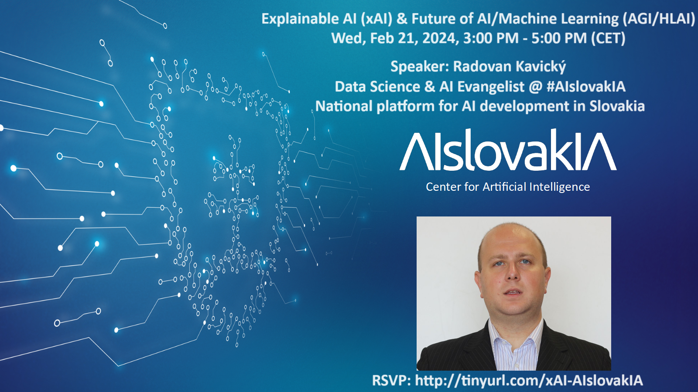
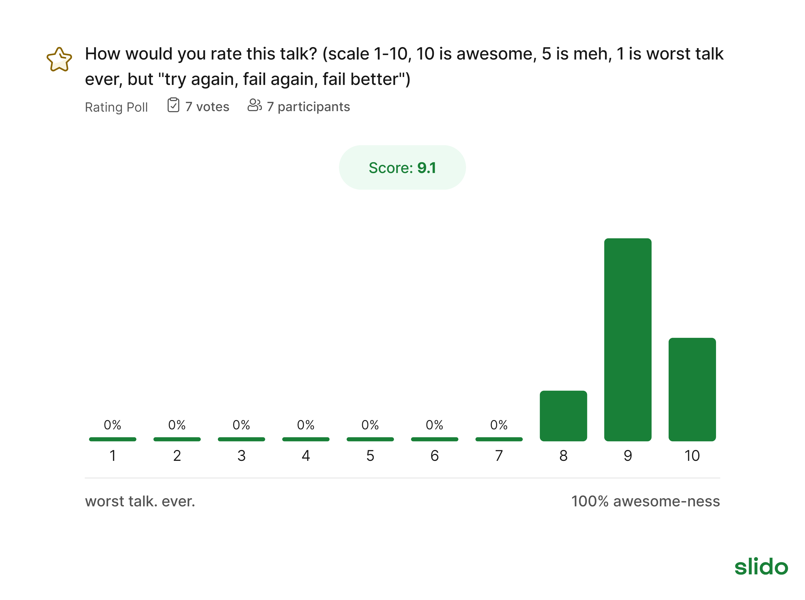

# aislovakia2024
Slides from AI Radio event + sli.do report

krátke linky (všetky):

Zoom/call (treba zadať passcode: xAI): tinyurl.com/xAI-Passcode

RSVP: tinyurl.com/xAI-AIslovakIA

Slide-y (aj na stiahnutie): tinyurl.com/slides-xAI

Na sli.do (integrované aj v slide-och): tinyurl.com/xAI-slido

No a na GitHube všetko dostupné bude tu: tinyurl.com/xAI-github 

+direct link: https://github.com/radovankavicky/aislovakia2024

You were awesome too, thank you! [Disclaimer: avg 9.1 out of 7 votes/active attendees till the end/peak was 40, and 20 remains till the end of over 2h 20 min. long mega talk... recording soon on our YouTube here: https://www.youtube.com/watch?v=oU57-hKIUn4&list=PL2AfQ495twI8l9cGimg3BTs54HJ8E7j-S&index=1]

Slides for download here: http://tinyurl.com/slides-xAI and also on GitHub: https://github.com/radovankavicky/aislovakia2024

Full sli.do report/interactivity with the audience during talk: 

https://analytics.slido.com/share/_SP9-lyYOe3Itdu2q2e2_3HY_8pkyfQrXI8p_f1cnl6YiMxciSP9_lySPlyMPlyNPlyZOe0ypAlqtb6zREa5cabydk_ZXIVXz83PydDNydDPzFyOOd0cwnwtsp498EImywZgYiValFL8ajfhhzIh_UUUhjSqdA 

+output from Zoom AI (companion app/tool for summary of talks/webinars that we used for the first time)/generated output by AI on top of Zoom functionality: 

Quick recap
The meeting hosted by AIslovakIA discussed various topics related to AI development and trends in Slovakia. The main topics included the purpose and structure of AI radio meetups, current AI trends, the history and objectives of OpenAI, the potential implications of AI advancements, the ethical concerns surrounding AI, the advancements in AI technology, the ethical concerns surrounding AI in the military and security industries, the significance of data science in AI development, the potential of transhumanism, the importance of advanced technologies for social good, and the potential risks of these technologies.
Summary
AI Radio Meetups: Slovakia's AI Development Trends
The meeting, hosted by AIslovakIA, was about to commence with a few more attendees expected. Once the required number was reached, the meeting began. The host welcomed everyone and set the time schedule. The meeting was about AI radio meetups, a series of sessions focusing on AI development and trends in Slovakia, initiated by the Technical University of Kosice. The speaker, representing AIslovakIA, discussed the purpose of these meetups and shared the structure of the upcoming talk, which will cover current developments and trends, future trends, ethics and transparency, and the concept of explainable AI. The speaker also mentioned the use of a platform called Slider for interactive Q&A.

AI Slovakia and Current AI Trends
AIslovakIA introduced himself as an economist turned data science consultant and AI researcher. He shared his involvement in various initiatives such as the creation of AI Slovakia, a platform connecting key players in the AI industry, and his role as an instructor for Data Camp and Base Camp AI. He also discussed his previous work in the public sector, where he advised the Prime Minister on AI implementation in the judicial system. AIslovakIA then shifted the discussion towards current AI trends, specifically the new technology Sora, which can generate complete videos from text prompts.

OpenAI's History, Objectives, and Ethical Implications
AI SlovakIA presented the history and objectives of OpenAI, a nonprofit organization aiming to connect AI experts and provide them with funding. The organization's primary research goal is to develop artificial general intelligence (AGI). AIslovakIA also discussed the concept of human-level AI and its potential evolution into super intelligence, noting that we have not yet reached this stage. The speaker emphasized the importance of creating models that simulate a 3D world and the global pursuit of AGI by various governments. The ethical implications of AI were also discussed, highlighting concerns about potential misuse. Finally, AIslovakIA mentioned a proposal by OpenAI's CEO, Sam Altman, to create a specialized AI chip infrastructure.

AI's Future: Potential Benefits and Risks
AIslovakia discussed the advancements in artificial intelligence (AI) and their potential implications. The speaker highlighted that AI is becoming more powerful and could surpass human intelligence by 2030. They discussed the benefits of AI, such as optimizing our planet, discovering our solar system, and extending human life. However, they also noted the potential risks and negative consequences of AI, including the loss of human intelligence and the ethical implications of AI's abilities. The speaker concluded by emphasizing the need to prepare for the arrival of AI and, importantly, to discuss what it means to be human in relation to AI.

Flawless AI: Ethical Concerns and Innovation Discussed
AIslovakia introduced a new technology, Flawless AI, which can modify video or film content by changing language, muting actors, or altering dialogue. This technology has potential uses in generating individualized movies and disrupting the fake news industry. However, ethical concerns were raised, particularly regarding the use of open-source data and the potential for these models to be used for malicious purposes. AIslovakia also discussed the rapid pace of technological innovation, the dominance of major tech companies, and the potential for bias in these systems. They highlighted the importance of innovation in technology and the affects of it on businesses, predicting that the future source of innovation will be systems, rather than the human brain.

AI Advancements and Ethical Concerns in Military and Security Industries
AIslovakIA discussed the advancements and ethical concerns surrounding AI, particularly in the military and security industries. The conversation emphasized the importance of regulation and ethical considerations, the potential dangers of AI in warfare, and the emerging field of explainable AI. AIslovakIA highlighted the importance of simplicity and explainability in machine learning models, the application of Shapley values in deep learning, and the concept of a deep learning architecture. The meeting also focused on the process of calculating checklist values for a model and the functionality of the Shipley tool for analyzing tabular data and explaining the behavior of models within a training phase. The significance of understanding and trusting AI systems, especially in high-risk applications, was also emphasized.

AI's Impact on Slovakia's Economy and Development
AIslovakIA recommended several books related to machine learning and AI, including "The Hundred-Page Machine Learning Book" and "Explanation-Based AI". AIslovakIA also highlighted the potential threat of automation and AI on the Slovakian economy, particularly for labor-intensive industries like the automotive industry, and emphasized the need for Slovakia to adapt to these changes. AIslovakIA also discussed the current state of AI development in Slovakia, noting the investments made by the country and the main players in the AI sector. However, AIslovakIA pointed out that Slovakia's investment in AI is relatively small compared to other countries and stressed the need for better prioritization and implementation of AI strategies, as well as improved data security.

Data Science and AI Evolution Discussion
AIslovakIA discussed the significance of data science in AI development and its future trends. They emphasized the process of problem-solving in data science, highlighting the importance of data collection, transformation, visualization, modeling, and validation. The speaker also discussed the evolution of the data science industry, noting its shift from hype to practical application in both private and public sectors. They highlighted the importance of decision makers in the government and public sectors, and suggested that data scientists might be among the first roles to be automated. Furthermore, AIslovakIA discussed the concept of artificial intelligence and its potential impact on human society, emphasizing that AI's main goal is to transform raw data into actionable decisions, and the emergence of AI systems capable of generating knowledge and wisdom.

Data Reality and AI Limitations
The speaker, AIslovakIA, discussed the concept of data reality and its limitations in the context of AI. The speaker emphasized that data alone cannot define reality, as it often omits crucial aspects such as ecology, health systems, and natural resources. The speaker also highlighted the differences in perspective towards data between social scientists and computer scientists, with social scientists being more skeptical about the reliability of data. The speaker concluded by underscoring the importance of maintaining human values and ethics in the development and implementation of AI systems.

Transhumanism and AI Efficiency Discussed
AIslovakIA discussed the potential of transhumanism, the combination of AI and human knowledge, highlighting AI's efficiency and ongoing efforts to integrate it with human brains. They emphasized that while AI is based on computation, the human brain has a level of complexity and adaptability that machines cannot replicate. The discussion also emphasized the potential of machine reasoning and its role in achieving artificial general intelligence. The meeting wrapped up with AIslovakIA sharing personal experiences at AI conferences, emphasizing the significance of these events.

AI's Importance and Risks: GapData Institute's Mission and Future Plans
AIslovakIA discussed the importance of advanced technologies for social good and their potential risks. They highlighted the creation of the GapData Institute and their recent mission at the University of Cambridge. They also mentioned working on their first academic paper and an invitation to a top AI event in Dubai. AIslovakIA expressed gratitude for support received and ended the discussion by encouraging participants to stay updated on future activities.

-----------------------------------------------------------
Event potom (pýtať sa otázky a interakcia) bola možné aj cez sli.do, direct link (hashtag: #AIslovakIA na sli.do): https://app.sli.do/event/7zBkaVLsjXxPCvKPJ2gUNS

resp. krátke linky (všetky):
Zoom/call (treba zadať passcode: xAI): tinyurl.com/xAI-Passcode
RSVP: tinyurl.com/xAI-AIslovakIA
Slide-y (aj na stiahnutie): tinyurl.com/slides-xAI
Na sli.do (integrované aj v slide-och... lol): tinyurl.com/xAI-slido
No a na GitHube všetko dostupné bude tu: tinyurl.com/xAI-github 
+direct link: https://github.com/radovankavicky/aislovakia2024

https://us06web.zoom.us/user/meeting/summary#/detail?meetingId=X609OKpfTxiYJoSQyR8omA%3D%3D&summaryId=mss_PW3cHue4RjWWP1QK1m_TrA

https://docs.google.com/presentation/d/1W2z6JdlraL2DpRuMyziUq3lguQ91Et0RusdbVJ-v1pY/edit?usp=sharing

https://analytics.slido.com/share/_SP9-lyYOe3Itdu2q2e2_3HY_8pkyfQrXI8p_f1cnl6YiMxciSP9_lySPlyMPlyNPlyZOe0ypAlqtb6zREa5cabydk_ZXIVXz83PydDNydDPzFyOOd0cwnwtsp498EImywZgYiValFL8ajfhhzIh_UUUhjSqdA

Slido Event - aislovakia_explainableAI_futureML_2024_final 

https://analytics.slido.com/share/_SP9-lyYOe3Itdu2q2e2_3HY_8pkyfQrXI8p_f1cnl6YiMxciSP9_lySPlyMPlyNPlyZOe0ypAlqtb6zREa5cabydk_ZXIVXz83PydDNydDPzFyOOd0cwnwtsp498EImywZgYiValFL8ajfhhzIh_UUUhjSqdA

https://www.youtube.com/watch?v=oU57-hKIUn4&list=PL2AfQ495twI8l9cGimg3BTs54HJ8E7j-S&index=1

https://us06web.zoom.us/user/meeting/summary#/detail?meetingId=X609OKpfTxiYJoSQyR8omA%3D%3D&summaryId=mss_PW3cHue4RjWWP1QK1m_TrA

